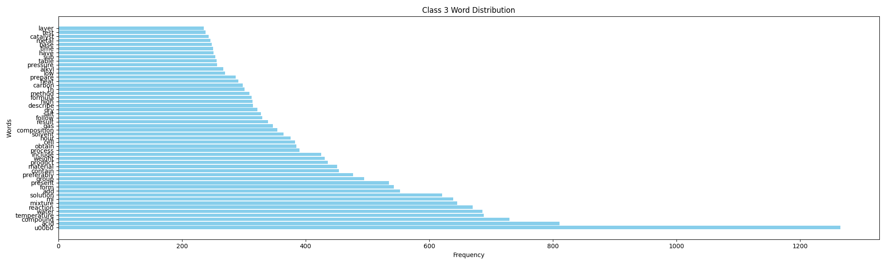
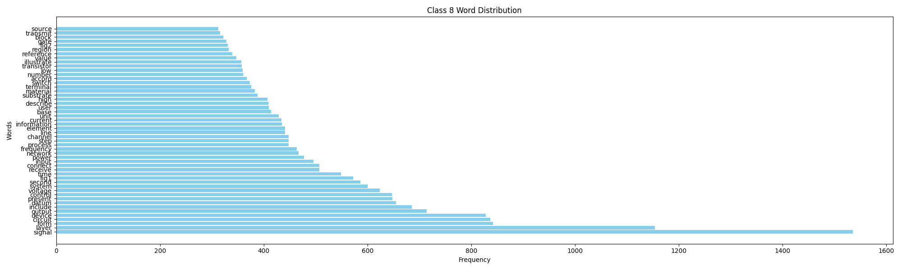
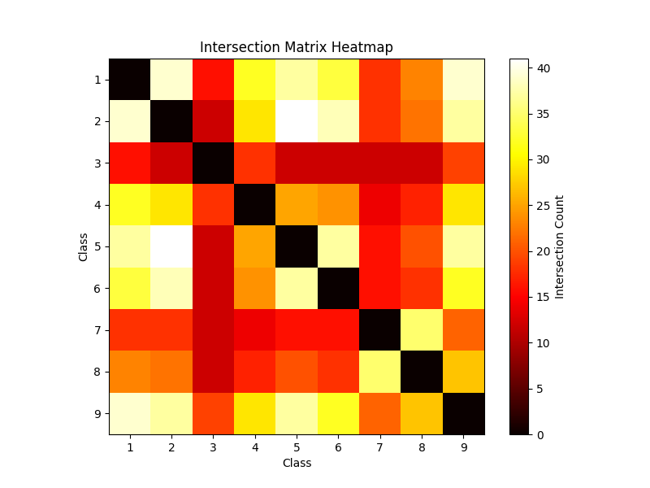
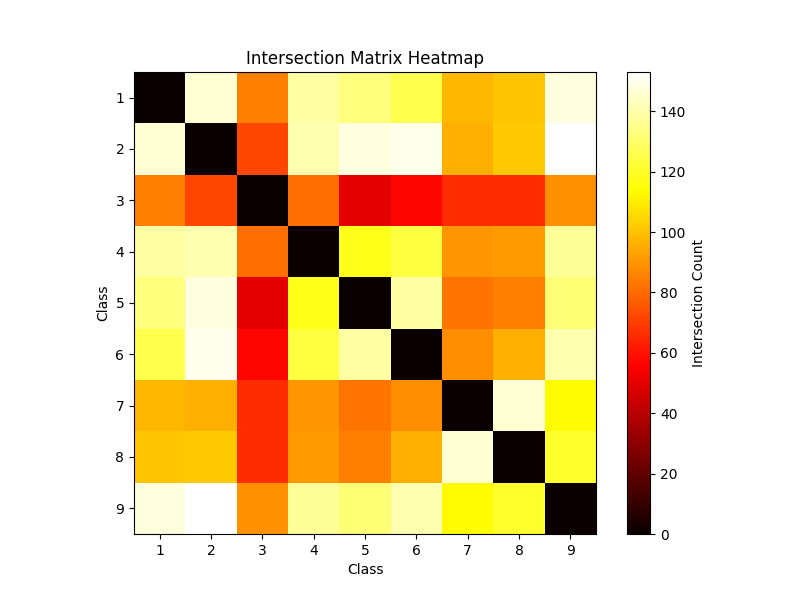
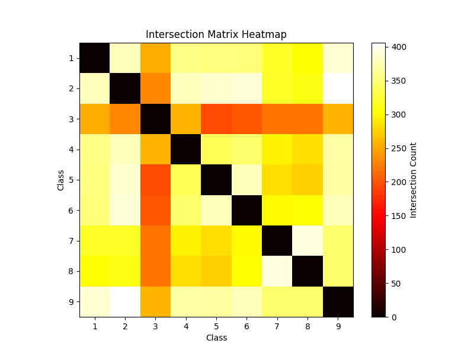
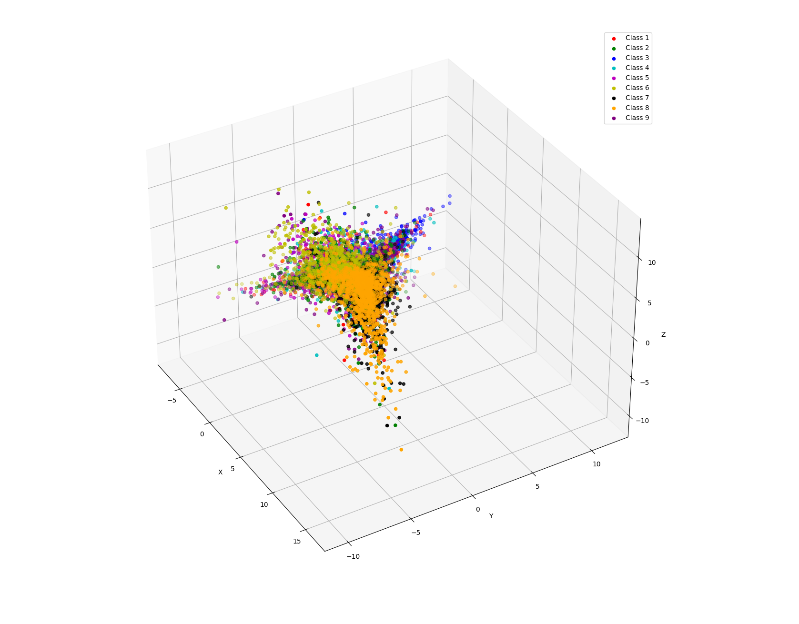

# Classification : A detail dive

## introduction : 
Classification, a cornerstone in Natural Language Processing (NLP), involves categorizing text data into predefined classes. Typically, this is achieved through training machine learning models to discern patterns in the data. However, "Classification: A Detailed Dive" takes a different approach. In this blog, we delve into the intricacies of feature learning, exploring techniques such as Principal Component Analysis (PCA), clustering and more to try to work things out when the model is not learning the features of the input data.
By leveraging visualizations, we aim to elucidate complex concepts surrounding the feature vector space. Unlike conventional tutorials, we dissect why models may falter in learning meaningful features from data and how techniques like PCA and clustering can aid in this process. Through this focused lens, readers gain a deeper understanding of NLP methodologies, empowering them to navigate challenges with clarity and precision. Welcome to "Classification: A Detailed Dive," where we unravel the mysteries of feature learning through visualization-driven exploration.

## Data:
The dataset comprises approximately 60,000 paragraphs, each categorized into one of nine distinct classes: Human Necessities, Performing Operations; Transporting, Chemistry; Metallurgy, Textiles; Paper, Fixed Constructions, Mechanical Engineering; Lightning; Heating; Weapons; Blasting, Physics, Electricity, and General tagging of new or cross-sectional technology. Unlike traditional classification tasks, where data is typically divided into two or three non-interlinked categories (e.g., happy/sad for sentiment analysis or good/bad for restaurant reviews), our dataset presents a unique challenge. The classes exhibit significant overlap, with categories such as Physics, Electricity, and Mechanical Engineering essentially forming a broader class under the umbrella of Physics.

This complexity poses a considerable challenge for classification algorithms. The feature vector space becomes cluttered, making it difficult for models to accurately discern patterns and categorize paragraphs with high precision. Achieving a conventional accuracy rate of 90-95% in such a task is unrealistic due to the intricate relationships between classes.

Understanding these nuances is crucial for developing effective classification strategies. In the upcoming sections, we'll explore how techniques like Principal Component Analysis (PCA) and clustering can help unravel the complexities of the feature vector space, enabling us to gain deeper insights into the classification process. Through visualization-driven exploration, we aim to shed light on the inherent challenges of classifying data with overlapping categories and pave the way for innovative solutions in NLP classification tasks.

Understanding Data and Creating the Feature Vector Space:

In dissecting the intricacies of our dataset, it's imperative to delve into the innate human ability to classify information. Intuition suggests that certain words are inherently linked to specific categories. For instance, in the realm of 'chemistry,' terms like 'acid,' 'container,' 'solution,' 'reaction,' 'mixture,' and 'compound' are likely to dominate. Similarly, each class boasts its distinctive lexicon. Visualizing this intuition through histograms for the top n words in each category offers invaluable insights into the underlying structure of the data  . 

However, transforming these frequency distributions into a coherent feature vector space presents numerous challenges. Firstly, common words such as stopwords, punctuations, and numerical values need to be excised from the dataset. This preprocessing step is efficiently executed using libraries like spaCy or NLTK. Secondly, certain words, while not classified as stopwords, appear frequently across all classes and hence lack class-specificity. Words like 'show,' 'end,' 'position,' 'embodiment,' 'portion,' 'invention,' 'surface,' 'provide,' and 'example' fall into this category and require manual curation post-histogram analysis.

The crux of the challenge lies in the interconnectedness of the categories. Given the overlap between classes such as Physics, Electricity, and Mechanical Engineering, creating a distinct boundary becomes elusive. Heatmaps illustrating the prevalence of the most common words across different classes further underscore this convolution. The heatmaps reveal that certain words, while integral to one class, also hold significance in others, blurring the lines between categories and complicating the feature vector space .

Navigating this complexity demands innovative solutions. While the path forward may not be immediately clear, the subsequent section explores various methodologies to address this conundrum. By acknowledging these intricacies and proposing potential avenues for resolution, we lay the groundwork for pioneering advancements in NLP classification tasks. This comprehensive understanding of the data landscape sets the stage for developing robust and adaptable classification models capable of navigating the nuances of interlinked categories and producing meaningful insights.

## Exploring Data Patterns with Principal Component Analysis (PCA)

After gaining insights into our dataset's structure and contemplating various approaches, the natural question arises: how do we determine which method or algorithm is likely to yield the best results? Moreover, how can we visualize the feature vector space to glean insights into its inherent patterns? Enter Principal Component Analysis (PCA), a powerful technique for unraveling hidden patterns within high-dimensional data.

PCA serves as a beacon guiding us through the labyrinth of the feature vector space. While delving into the mathematical intricacies of PCA is encouraged, let's develop an intuitive understanding of its essence. At its core, PCA decomposes the feature vector space into its principal components, represented by eigenvalues and eigenvectors. These components encapsulate the most significant variations within the data. Higher eigenvalues indicate that projecting the data along the corresponding eigenvectors captures a substantial portion of the input data's features.

Visualizing the vector space in three dimensions, with each class assigned a distinct color, provides valuable insights. The resulting 3D plot reveals a cluttered landscape, illustrating the complexity of decluttering the input data. While certain classes exhibit clear boundaries, the PCA singular values suggest the presence of potentially distinguishable clusters—indicating the possibility of untangling the data into four distinct classes. 

This visualization serves as a compass, guiding us toward understanding the underlying structure of the data and aiding in the selection of appropriate strategies for classification. By discerning patterns within the feature vector space, PCA empowers us to make informed decisions about algorithm selection, model architecture, and preprocessing techniques.

In essence, PCA acts as a lens through which we can peer into the intricacies of our dataset, uncovering hidden relationships and discerning underlying structures. Armed with this newfound understanding, we are better equipped to navigate the complexities of our classification task, paving the way for more effective and informed decision-making. As we proceed, we harness the insights gleaned from PCA to refine our methodologies, ultimately steering us closer to achieving our classification goals.

## Exploring Solutions: Deciding the Approach

In our quest to address the challenges posed by the interlinked nature of our classification problem, we encounter two overarching categories of approaches: those centered around sequence-preserving feature vectors and those based on frequency-based feature vectors, disregarding sequence preservation. Each avenue presents its own set of advantages and drawbacks, as we shall now examine.

The first approach entails preserving the input sequence, a task that can be tackled through various methods. Firstly, employing Long Short-Term Memory (LSTM) networks with linear layers presents a viable option. However, given the average length of our inputs, which spans approximately 500 tokens, LSTMs might struggle to effectively preserve the sequence beyond 100 tokens. Alternatively, leveraging transformer-based architectures atop an embedding layer offers another avenue. While transformer models excel in capturing long-range dependencies, they may still face challenges in handling the intricate relationships between classes. Finally, fine-tuning pre-trained models like BERT for downstream classification tasks remains an enticing prospect. Yet, given the interconnected nature of our classes, relying solely on pre-trained models might yield suboptimal results. Hence, a bespoke transformer-based layer, replete with multiple attention heads, feed-forward networks, and dropouts to mitigate overfitting, emerges as a promising solution.

On the other hand, the second category revolves around utilizing frequency as feature maps, disregarding sequence preservation. This involves creating a vocabulary consisting of the top n words across all classes and constructing feature vectors based on the frequency of these words within each paragraph. Subsequently, we encounter several options: leveraging classical machine learning techniques such as Support Vector Machines (SVMs), gradient-based methods, and tree-based methods for classification; employing neural networks comprising solely of linear layers; or adopting a hybrid approach. The hybrid approach involves amalgamating certain classes based on the most common words, as identified from the heatmap analysis, and training multiple models to first perform broad classification before refining the subclass classification.

Ultimately, regardless of the chosen approach, all methods yield comparable results with an accuracy range of 5%. The selection of the algorithm rests upon the specific nuances of the dataset and the desired trade-offs between interpretability, computational complexity, and performance. By exploring these diverse methodologies, we pave the way for informed decision-making in devising effective strategies to tackle the intricate challenges of our classification task.

## Unraveling the Maze: Conclusions

In our journey through the intricacies of machine learning's feature space, we began with data visualization, seeking patterns. Using Principal Component Analysis (PCA), we distilled the essence of this space, identifying key structures.
Exploring various algorithms, our goal wasn't just high accuracy but to understand the role of statistics in ML. Machine learning is about interpretation, and statistics provides the tools. A deep understanding of data and its features is vital for model success.
In summary, this blog underscores the importance of statistics in machine learning. Interpretation, guided by statistical insights, drives meaningful progress. As we conclude, let's carry forward this understanding to navigate future ML challenges with clarity and insight.
